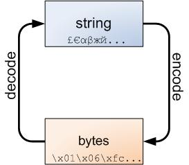

# Python168的学习笔记4

## 普通文本文件的读写

要养成好习惯，在open的时候指定encoding参数，不然会使用系统默认编码方式，这就会有问题。

要理解好Unicode三文治这个idea，对于计算机来讲，字节序列（bytes）是他们的语言，而我们的语言是字符串（string），bytes经过解码（decode）变成string，string经过编码（encode）变成bytes。

## 对于二进制文件的读写

关于处理二进制文件。以wav音频文件为例，其文件头部的44个字节是对wav的定义，参数，其44之后的字节就是data 类了。

可以用struct.unpack(type,data)来对文件头进行解析以获得相应的参数。type根据字段的长度，比如2个字节，用h；4个字节，用i。data可以直接从文件头切片出来。

对data类的操作，需要创建特定的数组来存放。用arry.arry(type,iter),type指这个数组的类型，iter指初始化数组的迭代器。

先用f.seek(0,2)移到文件的末尾，然后f.tell()就可以得到文件的总字节数。数组的长度就等于 总字节数减去文件头的44个字节，然后再除以bitspersample（每个数据样本的长度，在wav中这个值是2)。所以，最后就可以用arry.arry('h',(0 for _ in xrange(n)))来创建这个数组了。注意操作文件指针回到data类，也就是f.seek(44),然后再用f.readinto()来将数据读入到数组中去。这样就可以对数据进行操作了。

关于将操作后的数据写入文件：f = open('test.wav','wb')，先写入文件头，也就是那44个字节，f.write(info),然后导入数据buf.intofile(f)就完成了，最后记得f.close()。

总结就是：

1. mode参数中加上'b'，来以二进制模式打开文件。
2. 二进制数据可以用readinto，读入到提前分配好的buffer中，便于数据处理。
3. 解析二进制数据可以使用标准库中的struct模块的unpack方法。

## 写入文件的缓存设置

可以在open函数中指定buffing的参数值。

* 全缓冲：buffering的值为大于1的整数n，n即为缓冲区大小，当写入字节数达到此容量大小，即会被写入缓存。
* 行缓冲：buffering的值为1，即以换行符为标识，出现换行符就写入。
* 无缓冲：buffering的值为0，即立即写入。