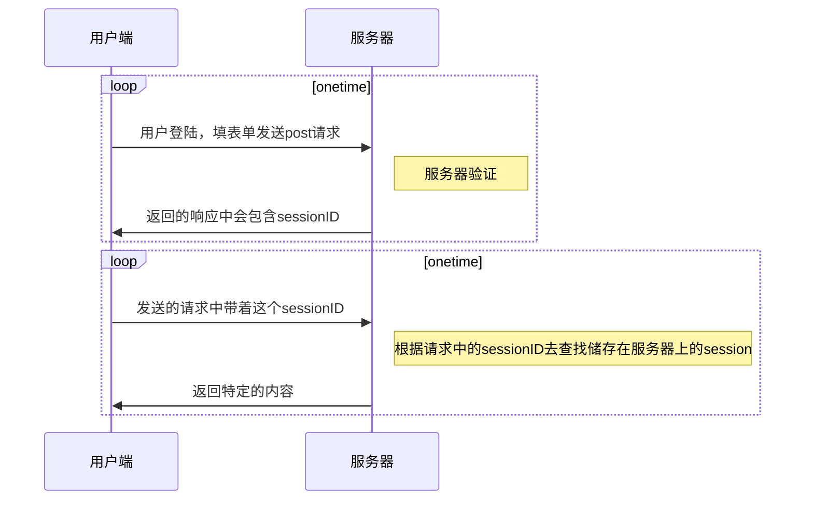

# 深入一下Django的用户认证和cache

## 用户认证

首先明白一个概念，http协议是无状态的，也就是每一次交互都是独立的，那如何让服务器和客户端进行有状态的交互呢，现在较为常见的方法就是让客户端在发送请求的时候带上服务器给他的身份证（特定的cookie），以此来识别来访者的身份。

### 关于session和cookie

这两者的作用都是储存数据，以此方便服务器和客户端进行有状态的交互。然后cookie是确实存在于客户端的浏览器中，而session信息则是保持在服务器中，这两者之间的联系就是，这个sessionID是存放到cookie中的，每次请求，客户端都会带上这个sessionID来告诉服务器我是谁。

### 具体实现

通过上面讲的，实现用户认证，实际上就是维护一个有状态的交互（会话）。Django已经内置实现了session，只需要在中间件中启用session模块（这是默认启用的），那么就可以通过操作request对象的session属性，来控制这个有状态的交互。

一般的流程就像这样：

### 实现细节

#### 怎么验证

当中间件启用`auth`和`session`后，直接调用`request.user.is_authenticated`就可以知道这个请求是否验证的了。

####保存方式

可以在配置中指定`SESSION_ENGINE`，可以选择放在数据库、缓存、文件或者cookie中。

#### 使用方式

在视图文件`view.py`中，可以直接把`request.session`当成字典来使用。

如果想在其他地方使用`session`的内容，也可以直接实例化一个数据库的连接（SessionStore）来进行交互。

#### 过期设置

针对单个`session`用`set_expiry()`来设置过期时间，也可以通过在配置中`SESSION_EXPIRE_AT_BROWSER_CLOSE`选择是否在浏览器关闭时清除会话信息，这都取决于具体的业务需求。

#### 删除会话存储信息

我们知道每维护一个会话，就要存储一行数据，也就是说当会话越来越多，所要存储的数据也会越来越多。如果选择会话的存储方式为数据库或者文件系统，Django会在用户登出时自动删除掉对应的会话数据，但是如果用户不主动登出，那么就算过了过期时间，Django也不会去删除对应的会话数据，需要我们手动去执行`cleansessions`才行，文档是建议我们用一个定时任务`cron`来执行这一步。如果存储方式为缓存则没有这个问题，Django会自动删除过期会话数据。至于存储方式选择为cookie的就更加无所谓了，因为数据都只在用户端。

## Cache

之前大概介绍过怎么使用Django的缓存系统，现在更深入一点介绍其使用方式。

之前使用的缓存逻辑是很粗鲁地直接整页缓存，其特点就是每个用户看到的缓存页面都是一样的，缓存有效时间内，一份缓存就可以满足所有请求，但是缺点就是不能根据特定用户返回特定页面。

### 使用Vary头来区分

用`patch_vary_header`来指定以响应头部的特定信息来区分不同的缓存，比如`patch_vary_header(response, 'cookie')`就会根据`cookie`的信息来选择返回的哪一个缓存。

### 使用模版文件的缓存标签
可以选择缓存模版文件(template)中的某部分，也就是生成最终页面时，一部分页面来自缓存，一部分页面即时生成。

### 直接与缓存数据交互

可以实例化一个与缓存系统的连接，以此来存取一些更耗时的操作结果。例如有一个很复杂的数据查找，可以将结果存到缓存中，在缓存有效时间内，就可以用一次简单的查找来代替那个复杂的查找。

### 返回304

可以在响应头部加上`ETag`和`last-modified`，用户端在下次请求同一个页面时会带上这两个信息，服务器会先校验这两个信息，如果页面没发生变化，则直接返回一个状态码为304，body为空的响应，告诉浏览器直接使用本地缓存即可。Django提供了一个中间件`ConditionalGetMiddleware`来帮助我们验证这两个信息。或者可以自己手动在响应头部添加相关信息，和手动验证。

### 小小总结

上述的前三种方式，服务器都是或多或少先生成一个（部分）缓存页面，然后在客户端下次请求相同页面时，利用缓存来生成页面并返回（或者直接返回缓存页面，反正就不是即时生成页面）；而最后一种方式，则是服务器校验请求的头部信息，看客户端所请求的页面是否在其上一次请求后有发生变化，如果没有，则返回一个304，说你直接使用本地的缓存就可以了。

### PS

关于将session存到cookie中这种形式，虽然说可以通过加密方式将一些内容放到cookie中储存，但是个人还是觉得有点问题，而且cookie的储存大小是有上限的，并且过大的cookie会增加处理请求的负荷。