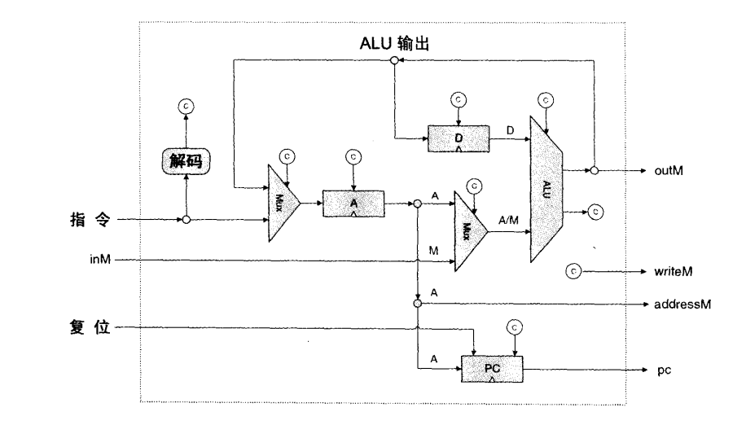

# the elements of computing systems 的读书笔记1

## 写在前面

想转职程序猿，还真不是说懂一门语言就够的了，想要继续进步，必须懂其相关实现原理，比如这些底层的构造。最近看的就是这一本计算机入门级的书，但是对我这个纯自学的人来说真是能学到很多。

 

这本书从最基本的Nand门开始逐步构建电路，讲真，大学里学过数电模电，但是一直感觉很虚，不知道学完之后如何运用，直到看到了这几章，才真正发现原来是这样的，通过精心设计，把对应logic gate连接起来，构成具有实际使用意义的电路。这本书只作为入门书，对象是零基础的人，所以最底层就是Nand门和DFF门了，然后根据这两个门来构建出一个简单的CPU，话讲起来很简单，但是当实际你真正构建出CPU来的时候，成就感还是很强的。

## 布尔逻辑

本书的第一章是讲了布尔逻辑，这一章一开始讲了最基本的逻辑关系，感觉就是高中的知识，各种与或非，然后将这种与或非抽象的概念用logic gate来物理实现，如输入低电平，就会输出高电平。然后就是利用与或非来构建选择电路，如DMux门，Mux门，实现起来也不难，感觉就是对各个输入（或者输出）加上一个系数，使其为0或为1就能决定最终输出是什么了。最后就是构造多位逻辑门，因为单个输入输出是远远满足不了我们的需求，所以需要横向扩展，简单来讲就是将各个门这样叠起来，叠16个就是16位，叠32个就是32位，如此类推。以上所有门的实现都用了HDL语言，难度不大，具体芯片的输入输出都已经给定了，只需要补充PART中的内容就行了，也就是往PART中添加其他已经实现的芯片，构造特定的输入输出，来最终完成给定目标。

## 布尔运算

本书的第二章是讲了布尔运算，这章主要内容就是根据了第一章已实现的各种逻辑门，来构造具有运算功能的门，这里是只实现了加法。加法的具体实现就是利用了二进制的进位，一个一个门的叠加上去。然后就是讲了补码，补码就是实现了负数的表示，按照书上的讲法：补码就是对X的所有位取反，然后加上1。而我个人的简单记法就是0=-1+1,1=-2+1,2=-3+1，如此类推。补码的意义在于：利用补码可以实现减法，也就是加上一个负数。当实现完加法，减法和第一章中的逻辑操作，就可以将这些功能都封装起来到一个芯片中，就是ALU，算术逻辑单元。个人在实现ALU时的思路就是根据每个输入位进行判断，从第一位开始判断，然后将其输出当成下一个输入位的输入，一直对这一个输入（出）进行操作，直到最后输出。

## 时序逻辑

本书的第三章是讲了时序逻辑，这章就是讲了内存的具体实现。以前刚接触电脑的时候，知道内存里的东西是断电就没了，而磁盘内的东西无论有没电一直都有，但是并不知道是为什么，而这章就讲了这个内存是如何实现的。这章引入了一个新的基本门DFF门，书中的解释是：DFF简单地将前一个时间周期的输入值作为当前周期的输出。DFF门能够这样做的原因是他还有一个时钟输入，但是这本书并没有再往下讲其实现原理，所以明白DFF是在下一个时间周期才输出就行了。当看书看到这点的时候，我就大概明白了内存的实现逻辑，不断输出前一周期的输出（将前一周期的输出当成输入），这样一直输出那一个输出，这不就是实现了储存功能吗。（PS：这个DFF门就是数电中学到的D触发器）单位寄存器就是基于这个DFF门实现的，只需要在输入的时候选择是输入新的输入，还是输入上一周期的输出，所以增加一个load的选择位就可以实现这个DFF门了。实现完单位寄存器后，把16个叠起来就是16bit寄存器了。RAM8其实就是简单将8个16bit寄存器叠起来，然后加入一个寻址功能来确认是选择哪个寄存器来操作。RAM64的实现也是类似，将8个RAM8叠起来，加寻址器。书里按这个方法，一直叠到16k。这一章除了实现这个内存，还实现了一个计数器。计数器与寄存器相似，但是能够实现在下一周期进行自加，所以就是在寄存器的基础上添加重置和自加这两个功能。在具体实现的时候要分清输入是在t-1周期，输出是在t周期，所以所有对输入的处理都要在DFF门之前。

## 机器语言及构建CPU

前三章都是讲了很基础的东西，个人看起来很容易就接受了，但是去到第四、五章，就感觉有点吃力了，一下子构建不起来相关知识点。需要多看几遍。

第四章主要介绍了机器语言,机器语言只是一种约定形式，这一章讲了如何去运用这种底层语言来操作硬件，而将如何用硬件实现放到了第五章。这章介绍了Hack汇编语言，在刚接触的时候真心很难理解，因为他是一种较低级的，静态的语言，比如他的格式是固定的：先是一条A指令指定操作什么，然后接C指令怎么操作；预定义的符号，比如字母D是一个固定的储存数据的寄存器，他作为一个独立的存储空间，暂时存储数据。

第五章讲了如何用之前构造的芯片来组合成计算机。主要难点在如何构建CPU上，简单来讲，CPU就是由ALU，A、D寄存器和计数器组成的，在设计电路时要明白两点：1、ALU的输入X，Y是由D寄存器、A寄存器/M内存的输出；2、计数器的跳转条件要结合ALU的输出和C指令的J位来考虑。



## 个人思路

根据给出的提示图，对标记C的部分做逻辑设计就行了。

先对D寄存器进行设计，因为D寄存器的输入是由ALU输出提供，所以不需要额外对输入进行判断，然后根据输入的指令，如果输入指令是C指令，且需储存在D寄存器，也就是d2位是1的话，则将D寄存器的load位置1。

然后是A寄存器是储存地址或者常数，所以要对A寄存器的输入进行判断，如果外部输入指令是A指令，则选择这个A指令更新到A寄存器中；如果外部输入是C指令，则选择执行ALU的输出，且根据C指令中的d1位看是否需要更新数据到A寄存器。确定好A寄存器的输入输出后，addressM就得到了，后面还要对C指令的a位进行判断，看是将A还是M当成ALU的输入。

writeM的判断很简单，就是判断是否是C指令，且d3位置是1就行了。

PC的输入就是A寄存器的输出，主要要对其load位逻辑进行设计。因为ALU的输出有zr，ng，所以对他们进行操作，得出一个大于零的表达式，最后用这三者去分别和C指令的J位比较，得出是否发生了跳转，如果发生了跳转就对PC的load位进行操作。

```shell
Mux16(a=instruction, b=outALU, sel=instruction[15], out=outmux1);  // 判断是A指令还是C指令，如果是C指令，则使用ALU输出的地址
 
Not(in=instruction[15], out=nota);  // A寄存器是放地址或者数据的，如果输入是A指令，则要将其更新到A寄存器
And(a=instruction[15], b=instruction[5], out=cloadA);  // 如果是C指令，则要判断是否要储存到A寄存器
Or(a=nota, b=cloadA, out=outor);  // outor作为A寄存器的load位，决定是否更新A寄存器
ARegister(in=outmux1, load=outor, out=outA, out[0..14]=addressM);
 
And(a=instruction[15], b=instruction[12], out=cm);  // 如果是C指令，则要确定a位
Mux16(a=outA, b=inM, sel=cm, out=outAM);
 
And(a=instruction[15], b=instruction[4], out=cloadD);  // 如果是C指令，且要储存在D寄存器，那就更新D寄存器
DRegister(in=outALU, load=cloadD, out=outD);
 
ALU(x=outD, y=outAM, zx=instruction[11], nx=instruction[10], zy=instruction[9], ny=instruction[8],
f=instruction[7], no=instruction[6], out=outALU, out=outM, zr=zr, ng=ng);
 
And(a=instruction[15], b=instruction[3], out=writeM);
 
Or(a=zr, b=ng, out=zrorng);  // 结合ALU输出的结果去判断J位的跳转
Not(in=zrorng, out=dayuling);
And(a=instruction[0], b=dayuling, out=j3);
And(a=instruction[1], b=zr, out=j2);
And(a=instruction[2], b=ng, out=j1);
Or8Way(in[0]=j3, in[1]=j2, in[2]=j1, in[3..7]=false, out=jjj);  // 看是否出现跳转
And(a=instruction[15], b=jjj, out=pcload);  // 要留意前提是C指令
 
PC(in=outA, load=pcload, reset=reset, inc=true, out[0..14]=pc);
```

