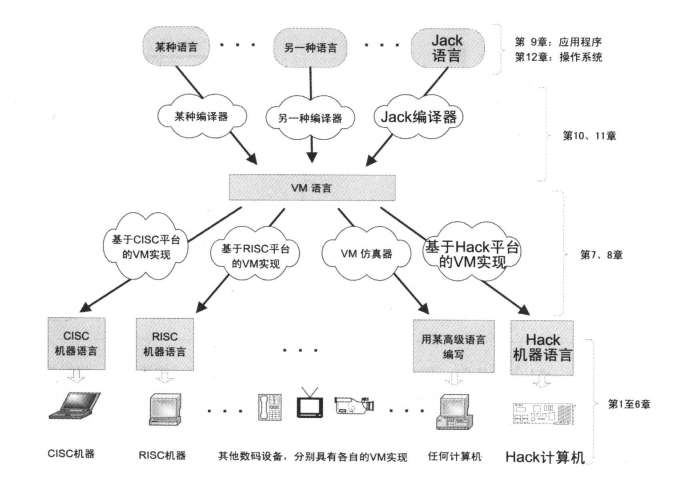

# the elements of computing systems 的读书笔记2	

懒癌发作，本来计划是两到三天就一个unit的，没想到一直拖到今天才完成第二部分（6-8章）。

## hack

第6章，介绍了hack汇编到二进制，也就是用翻译到01来表示。从课后习题来看，这一章目的就是设计一个程序（汇编编译器），按汇编规范（规则）来将asm文件转换成hack文件。从实现来讲，就是逐句翻译成对应的代码就行了，难度并不大。重点是要理解翻译完之后，背后的硬件是如何执行的。首先明白这一部分的硬件构成，有ALU运算单元，A、D高速寄存器，RAM内存，ROM指令内存。在明白hack命令的16位数字每一位分别代表的意义之后，就可以直接进行转换程序的设计了。这个语言是一种很底层的语言，语法特点是先定位到特定的地址，然后再对地址的内容进行操作。

## VM虚拟机

第7章，介绍了VM虚拟机。首先解释了，我们都知道，无论我们运用哪种语言就行编程，最终都会转换成一系列的0和1，但是并不是说高级语言一下子就能转成0和1，因为每个硬件结构都不太如一，也就是硬件的API不尽相同，而高级语言的API也不尽相同，现在引入一个新的概念，虚拟机，也就是VM层，这一层的好处就是，极大地提高了通用性（？，不知道怎么形容会更好，书中是这样说的：高级语言编写的程序一旦被编译成VM代码，那么就可以在任何配备了对应VM实现机制的硬件平台上运行）。

个人理解就是，vm层是介于高级语言（就是我们日常接触的编程语言）和底层语言（汇编语言）中间的部分。

当然这章还引入了一个非常重要的概念，就是堆栈（LIFO，后进先出），堆栈这个模型真是美妙得不知道怎么形容。书中表达了一个观点：任何算术表达式和布尔表达式（不管多复杂）都能被系统化地转成一系列在堆栈上的简单操作，并系统化地计算出来（这句话表达了个很厉害的观点，我个人理解就是体现了计算机中一个很重要的概念：抽象，无论是任何式子，都能够被分解成简单的小部分。）

这章的课后习题就是先构造VM编译器的一部分，实现其中的算术运算，访问内存等功能。具体实现也就是逐句翻译，当然要理解堆栈中，指针的变化，如何将A、D寄存器作为中间存储器来实现对M（内存）内容的修改。

## 完善VM编译器

第8章，完善VM编译器。因为高级语言必定不可能是按直线顺序由头执行到尾的，其中一定会有跳转，换句话说就是突然从这里跳到那里，然后又回到这里，那么有一个必须需要做的工作就是，保存现场，这个时候又体现了堆栈这个模型的美妙之处，在调用子程序的时候，先将现场的各个参数（指针）压到栈里，然后等于重新在一个空的栈来执行子程序，子程序执行完之后，保存好返回的数值，又按之前存好的指针，回到之前的现场。

这个堆栈个人理解就是一个单进程（线程）的模型，同一时间，只处理栈顶部分的数据，调用子程序的时候，就是先保存现场，然后在栈顶压入子程序，处理完又回到主程序，这个设计真是很美妙啊。最终栈中为空，就意味处理完所有东西了。

这一章的课后习题其实也等于是逐句翻译，但是翻译到最后两个题时，就出错了，暂时发现自己思维已经陷进去了，除了重构找不到解决办法，但是又不想重构，所以就先放下了。